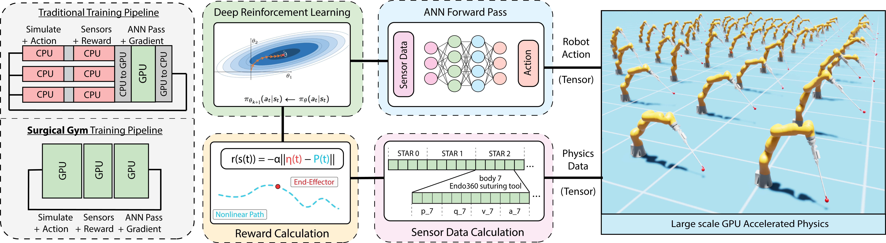

# Surgical Gym: A high-performance GPU-based platform for surgical robot learning (work in progress)



As the field of surgery evolves, one of its greatest advancements is the incorporation of robotic assistance. Surgical robots, operated by surgeons from a control station, have enabled less invasive surgical procedures with reduced effect by hand tremors. Although robots assist in over a million surgical operations annually, their operation remains human-dependent, lacking task-autonomy. Greater autonomy in surgical robots promises increased efficiency, reduced surgeon fatigue, and more minimally-invasive procedures. Recent applications of Reinforcement Learning (RL) for control strategies indicate a potential for automated surgery. Training robotic systems through reinforcement learning has been recently made easiser through the use of GPU-based physics simulators, accessing magnitudes more data than their CPU counterparts. Toward this, we introduce  **Surgical Gym:** an open-source platform optimized for GPU capabilities which runs up to 7000x faster than previous surgical simulators.**


## About this repository

This repository contains Surgical Robotic Learning tasks that can be run with the latest release of [Isaac Sim](https://docs.omniverse.nvidia.com/app_isaacsim/app_isaacsim/overview.html). Reinforcement Learning (RL) examples are trained using PPO from [rl_games](https://github.com/Denys88/rl_games) library and examples are built on top of Isaac Sim's `omni.isaac.core` and `omni.isaac.gym` frameworks. The environment design structure and some of the README instructions inherit from [OmniIsaacGymEnvs](https://github.com/NVIDIA-Omniverse/OmniIsaacGymEnvs).

If you find **Surgical Gym** useful in your work please cite the following source:

[Schmidgall, Samuel, Krieger, Axel, and Eshraghian, Jason. "Surgical Gym: A high-performance GPU-based platform for reinforcement learning with surgical robots." arXiv preprint arXiv:2310.04676 (2023).](https://arxiv.org/abs/2310.04676)

```bibtex
@article{schmidgall2023surgical,
  title={Surgical Gym: A high-performance GPU-based platform for reinforcement learning with surgical robots},
  author={Schmidgall, Samuel and Krieger, Axel and Eshraghian, Jason},
  journal={arXiv preprint arXiv:2310.04676},
  year={2023}
}
```


----------------------

### Table of contents

<!--ts-->
   * [Environments](#environments)  
   * [Installation](#installation) 
   * [Running trainings and examples](#running-trainings-and-examples)
     *  [Loading trained models](#loading-trained-models)
     *  [Configuration and command line arguments](#configuration-and-command-line-arguments)
     *  [Hydra Notes](#hydra-notes)
     *  [Training with Multiple GPUs](#training-with-multiple-gpus)
   * [Some code you can copy and paste](#some-code-you-can-copy-and-paste) 
<!--te-->

----------------------


## Environments

### The da Vinci System

The da Vinci Surgical System is a robotic surgical system designed to facilitate complex surgery through a set of multiple end-effectors that have interchangable attachments. 

The system operates through an interface with the **Master Tool Manipulator (MTM)**, which serves as the control center for the surgeon to direct surgical actions. Through the MTM's handles or joysticks, the surgeon's movements are captured and translated into corresponding motions of the **Patient Side Manipulators (PSMs)**, which are attachments responsible for gripping tissue. These PSMs carry out the movements dictated by the surgeon via the MTM, mimicking the surgeon's hand motions, allowing for very accurate and less invasive operations. The PSMs are flexible, multi-jointed instruments capable of holding and manipulating tissue, adjusting to the unique anatomy and requirements of each procedure.

### Patient Side Manipulator (PSM)


A third component of the da Vinci system is the **Endoscopic Camera Manipulator (ECM)**. The ECM is another robotic arm attachment that holds and controls the movement of a stereo endoscope, a special camera that provides a high-definition, three-dimensional view of the surgical field. This allows the surgeon, from the control console, to have a detailed and magnified view of the area being operated on, significantly improving precision and control during the surgical procedure.


### Endoscopic Camera Manipulator (ECM) 


### Smart Tissue Autonomous Robot (STAR)

The Smart Tissue Autonomous Robot (STAR) is a robot designed by a researchers at Johns Hopkins University and the Children's National Hosptial to perform laparoscopic surgery autonomously. The STAR robot has been used for a variety of autonomous surgical procedures, most notably, the first autonomous laparoscopic surgery for intestinal anastomosis (reconnection of two tubular structures such as blood vessels or intestines). The STAR performed the procedure in four different animals, producing better results than humans executing the same procedure.


----------------------

## Installation

### [Step 1]

Follow the Isaac Sim [documentation](https://docs.omniverse.nvidia.com/app_isaacsim/app_isaacsim/install_basic.html) to install the latest Isaac Sim release. 

*Examples in this repository rely on features from the most recent Isaac Sim release. Please make sure to update any existing Isaac Sim build to the latest release version, 2022.2.1, to ensure examples work as expected.*


### [Step 2]

Once installed, this repository can be used as a python module, `SurgicalGym`, with the python executable provided from the Isaac Sim installation.

To install `SurgicalGym`, first clone this repository:

```bash
git clone https://github.com/SamuelSchmidgall/SurgicalGym.git
```

Once cloned, locate the [python executable in Isaac Sim](https://docs.omniverse.nvidia.com/app_isaacsim/app_isaacsim/install_python.html). By default, this should be `python.sh`. We will refer to this path as `PYTHON_PATH`.

To set a `PYTHON_PATH` variable in the terminal that links to the python executable, we can run a command that resembles the following. Make sure to update the paths to your local path.

```
For Linux: alias PYTHON_PATH=~/.local/share/ov/pkg/isaac_sim-*/python.sh
For Windows: doskey PYTHON_PATH=C:\Users\user\AppData\Local\ov\pkg\isaac_sim-*\python.bat $*
For IsaacSim Docker: alias PYTHON_PATH=/isaac-sim/python.sh
```


### [Step 3]

Install `SurgicalGym` as a python module for `PYTHON_PATH`:

```bash
PYTHON_PATH -m pip install -e .
```


----------------------

## Running trainings and examples

As the first step we are going to make sure your visualization works and your libraries were installed properly. To do this, we will just run random behavior.

```bash
PYTHON_PATH scripts/random_policy.py task=STAR
```

You should see the STAR robot shaking around. If so you're ready to start training!

*Note: all commands should be executed from the location `SurgicalGym/surgicalgym`.*

To train your first policy, run:

```bash
PYTHON_PATH scripts/rlgames_train.py task=STAR
```

You should see an Isaac Sim window pop up. Once Isaac Sim initialization completes, the ECM target reaching scene will be constructed and simulation will start running automatically. The process will terminate once training finishes.

To achieve maximum performance, you can launch training in `headless` mode as follows:

```bash
PYTHON_PATH scripts/rlgames_train.py task=STAR headless=True
```

#### A Note on the Startup Time of the Simulation

Some of the examples could take a **few minutes** to load because the startup time scales based on the number of environments. The startup time will continually
be optimized in future releases of Isaac Gym (and hence Surgical Gym).


### Loading trained models

Checkpoints are saved in the folder `runs/EXPERIMENT_NAME/nn` where `EXPERIMENT_NAME` 
defaults to the task name, but can also be overridden via the `experiment` argument.

To load a trained checkpoint and continue training, use the `checkpoint` argument:

```bash
PYTHON_PATH scripts/rlgames_train.py task=STAR checkpoint=runs/STAR/nn/STAR.pth
```

To load a trained checkpoint and only perform inference (no training), pass `test=True` 
as an argument, along with the checkpoint name. To avoid rendering overhead, you may 
also want to run with fewer environments using `num_envs=64`:

```bash
PYTHON_PATH scripts/rlgames_train.py task=STAR checkpoint=runs/STAR/nn/STAR.pth test=True num_envs=64
```

When running with a pre-trained checkpoint for the first time, we will automatically download the checkpoint file to `surgicalgym/checkpoints`. For subsequent runs, we will re-use the file that has already been downloaded, and will not overwrite existing checkpoints with the same name in the `checkpoints` folder.

### Configuration and command line arguments

We use [Hydra](https://hydra.cc/docs/intro/) to manage the config.
 
Common arguments for the training scripts are:

* `task=TASK` - Selects which task to use. Any of `@PSM`, `@ECM`, `@STAR` (these correspond to the config for each environment in the folder `surgicalgym/cfg/task`)
* `train=TRAIN` - Selects which training config to use. Will automatically default to the correct config for the environment (ie. `<TASK>PPO`).
* `num_envs=NUM_ENVS` - Selects the number of environments to use (overriding the default number of environments set in the task config).
* `seed=SEED` - Sets a seed value for randomization, and overrides the default seed in the task config
* `pipeline=PIPELINE` - Which API pipeline to use. Defaults to `gpu`, can also set to `cpu`. When using the `gpu` pipeline, all data stays on the GPU. When using the `cpu` pipeline, simulation can run on either CPU or GPU, depending on the `sim_device` setting, but a copy of the data is always made on the CPU at every step.
* `sim_device=SIM_DEVICE` - Device used for physics simulation. Set to `gpu` (default) to use GPU and to `cpu` for CPU.
* `device_id=DEVICE_ID` - Device ID for GPU to use for simulation and task. Defaults to `0`. This parameter will only be used if simulation runs on GPU.
* `rl_device=RL_DEVICE` - Which device / ID to use for the RL algorithm. Defaults to `cuda:0`, and follows PyTorch-like device syntax.
* `multi_gpu=MULTI_GPU` - Whether to train using multiple GPUs. Defaults to `False`. Note that this option is only available with `rlgames_train.py`.
* `test=TEST`- If set to `True`, only runs inference on the policy and does not do any training.
* `checkpoint=CHECKPOINT_PATH` - Path to the checkpoint to load for training or testing.
* `headless=HEADLESS` - Whether to run in headless mode.
* `enable_livestream=ENABLE_LIVESTREAM` - Whether to enable Omniverse streaming.
* `experiment=EXPERIMENT` - Sets the name of the experiment.
* `max_iterations=MAX_ITERATIONS` - Sets how many iterations to run for. Reasonable defaults are provided for the provided environments.

Hydra also allows setting variables inside config files directly as command line arguments. As an example, to set the minibatch size for a rl_games training run, you can use `train.params.config.minibatch_size=64`. Similarly, variables in task configs can also be set. For example, `task.env.episodeLength=100`.

#### Hydra Notes

Default values for each of these are found in the `SurgicalGym/cfg/config.yaml` file.

The way that the `task` and `train` portions of the config works are through the use of config groups. 
You can learn more about how these work [here](https://hydra.cc/docs/tutorials/structured_config/config_groups/)
The actual configs for `task` are in `surgicalgym/cfg/task/<TASK>.yaml` and for `train` in `surgicalgym/cfg/train/<TASK>PPO.yaml`. 

In some places in the config you will find other variables referenced (for example,
 `num_actors: ${....task.env.numEnvs}`). Each `.` represents going one level up in the config hierarchy.
 This is documented fully [here](https://omegaconf.readthedocs.io/en/latest/usage.html#variable-interpolation).

### Tensorboard

Tensorboard can be launched during training via the following command:
```bash
PYTHON_PATH -m tensorboard.main --logdir runs/EXPERIMENT_NAME/summaries
```

## Training with Multiple GPUs

To train with multiple GPUs, use the following command, where `--proc_per_node` represents the number of available GPUs:
```bash
PYTHON_PATH -m torch.distributed.run --nnodes=1 --nproc_per_node=2 scripts/rlgames_train.py headless=True task=STAR multi_gpu=True
```

----------------------
## Some code you can copy and paste

The primary trainings for this repo are done through scripts that are written for you. However, I always love seeing some simple code that I can copy and paste into my IDE in a github README. So, here you go.

#### Visualize STAR with random actions
```python
import torch
import hydra
import numpy as np
from omegaconf import DictConfig
from surgicalgym.utils.hydra_cfg.hydra_utils import *
from surgicalgym.utils.task_util import initialize_task
from surgicalgym.envs.vec_env_rlgames import VecEnvRLGames
from surgicalgym.utils.hydra_cfg.reformat import omegaconf_to_dict, print_dict

@hydra.main(config_name="config", config_path="../cfg")
def parse_hydra_configs(cfg: DictConfig):
    cfg_dict = omegaconf_to_dict(cfg)
    print_dict(cfg_dict)
    headless = cfg.headless
    render = not headless
    enable_viewport = "enable_cameras" in cfg.task.sim and cfg.task.sim.enable_cameras

    env = VecEnvRLGames(headless=headless, sim_device=cfg.device_id, enable_livestream=cfg.enable_livestream, enable_viewport=enable_viewport)
    # sets seed. if seed is -1 will pick a random one
    from omni.isaac.core.utils.torch.maths import set_seed
    cfg.seed = set_seed(cfg.seed, torch_deterministic=cfg.torch_deterministic)
    cfg_dict['seed'] = cfg.seed
    task = initialize_task(cfg_dict, env)

    while env._simulation_app.is_running():
        if env._world.is_playing():
            if env._world.current_time_step_index == 0:
                env._world.reset(soft=True)
            # some random action
            actions = torch.tensor(np.array([env.action_space.sample() for _ in range(env.num_envs)]), device=task.rl_device)
            # apply action to physics environment
            env._task.pre_physics_step(actions)
            # forward simulate physics
            env._world.step(render=render)
            # post process physics
            env._task.post_physics_step()
            env.sim_frame_count += 1
        else:
            env._world.step(render=render)
    env._simulation_app.close()

if __name__ == '__main__':
    parse_hydra_configs()
```

Now you can run this code as follows:

```bash
PYTHON_PATH FILE_NAME.py task=STAR
```

